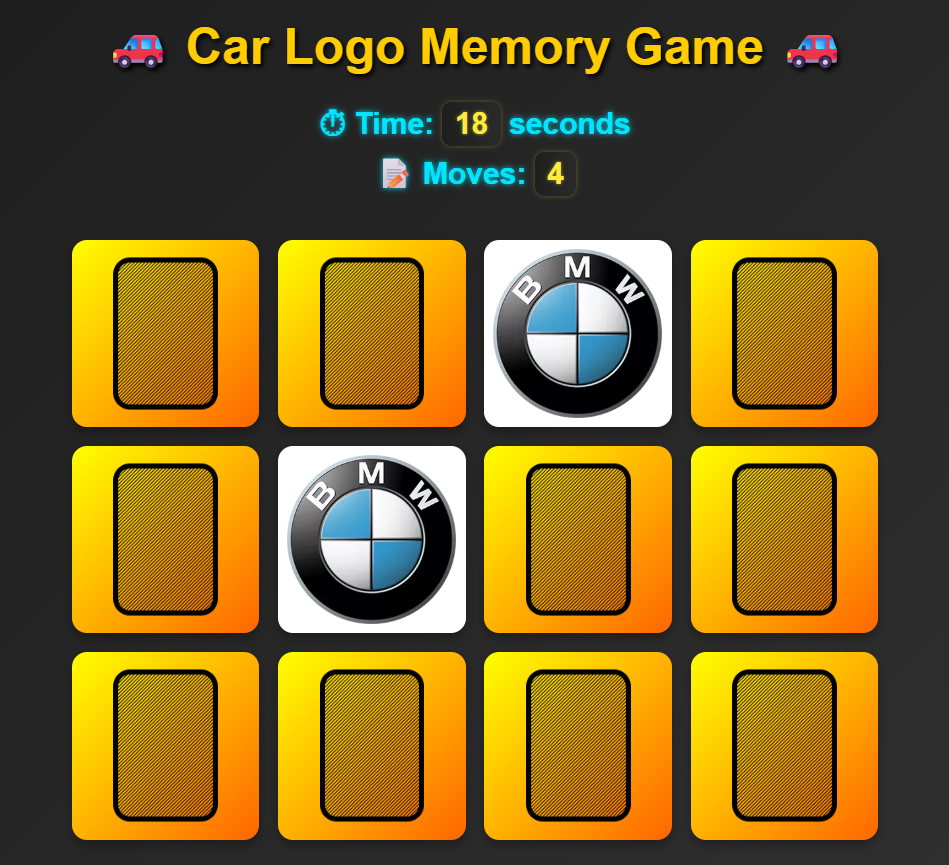

# 🃏 CognitiveCards - Memory Card Game

Welcome to *CognitiveCards*, an engaging and interactive memory card game built entirely with HTML, CSS, and JavaScript! Test your memory skills by flipping cards, matching pairs, and aiming for the highest score.

## View Demo...👇

[**Play the Game Here**](https://vignesh-kandem.github.io/CognitiveCards/)

## 🎮 Game Features

- 🧠 Flip cards to reveal hidden symbols  
- 🔄 Match pairs of identical cards  
- ⏱ Timer-based scoring for added challenge  
- 🏆 Track your best score   
- 🎨 Clean and modern interface with smooth animations  

## 🧰 Technologies Used

| Technology | Purpose |
|------------|---------|
| JavaScript | Game logic, card flipping, and score tracking | 
| CSS        | Styling, layout, and animations |
| HTML       | Page structure and card layout |

## 📦 Installation

Clone this repository:

```bash
git clone https://github.com/Vignesh-Kandem/CognitiveCards
cd CognitiveCards
```

## 🖼 Project Screenshot


